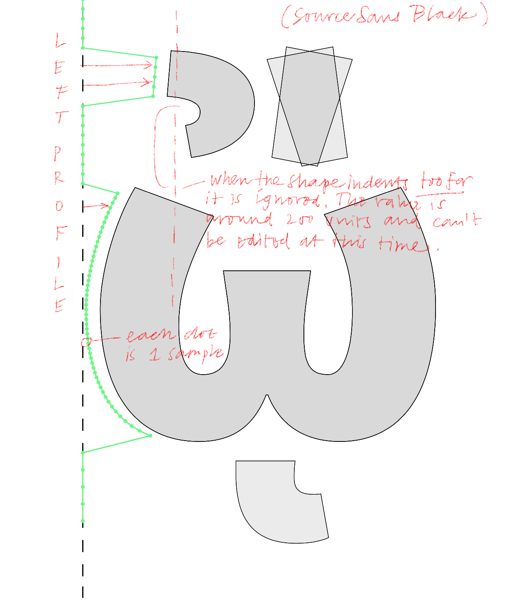

# TYPETR-Assistants-Resources

Resources in this folder are copied repositories. For reference of the owner, consult the License file in each repository.

They are copied here for consistent import of Assistants.

# LTR Similarity

This is an experimental approach to calculating a value that represents the similarity between the sides of different glyphs. RoboFont4 extension. 

Dedicated to my GitHub Sponsors! Your support makes research like this possible, thank you!

# GlyphNameFormatter

A system for generating glyph name lists from unicode data. 

* Unicode has long and descriptive names for each character.
* Font editors need glyph names to easily identify the glyphs, short, unique, can't use space
* Raw Unicode names are unsuitable for this purpose in font editors
* Font editors use their own lists that map names to unicode values.
* These lists only cover the glyphs that were needed in production, so there are often holes in the coverage.
* These lists should not dictate what is useful or not in a font but offer reliable unicode to name mapping.
* Adobe standardized some lists years ago, standard, but incomplete and immutable

### Glyph Name Formatted Unicode List Release 0.1

[download](https://github.com/LettError/glyphNameFormatter/releases)

Release 0.1 offers (almost) the same coverage as the Adobe Glyph Dictionary, AGD.txt
Look at `/names/glyphNamesToUnicode.txt` for a useful name to unicode map.

### Contributions

This release is not meant to be final. Many ranges have basic coverage but could be improved. Some Unicode names are wrong and then get translated wrong. The list does not claim authority or completeness. 

If you find things wrong and would like to share this insight, we're accepting comments, [open an issue](https://github.com/LettError/glyphNameFormatter/issues). If you see how the system works we will also gladly consider pull requests. If you would like to see certain ranges supported, let us know.

A public discussion about the prefixing and suffixing of names would also be useful.

This version acknowledges the help by Daniel, Bahman and Ilya. 

### Rules

* Glyph names should, as much as possible, only have script tags to disambiguate.
* Detect when script specific prefix or suffix is necessary
* Keep script prefix or suffix short

## Making lists

Run `test/buildRanges.py` to make all the name lists. They will be deposited in `names/ranges`. There will be other methods and other lists, but for now this is the place to make things.
You can also run each of the range scripts in `rangeProcessors/` and they will print a nice readable table with the processed name, unicode value, original name. There is also a column for names from the Adobe AGL if it has a different name for that entry. 

Run `test/analyseConflicts.py` to get an overview of all name clashes and how they are addressed. The results are in a text file in [names/conflict.txt](https://github.com/LettError/glyphNameFormatter/blob/master/Lib/glyphNameFormatter/names/conflict.txt)

Run `test/export.py` to generate a text file with <name> <unicode> pairs, exclusively with the available range processors. The results are in [names/glyphNamesToUnicode.txt](https://github.com/LettError/glyphNameFormatter/blob/master/Lib/glyphNameFormatter/names/glyphNamesToUnicode.txt)

Run `testAGDcoverage.py` to generate an overview of all glyphranges that are needed to match the Adobe Glyph Dictionary. It also calculates how far we are along.

## Range Processors

Given the rather large task of handling thousands of exceptions and tweaks, the package has a modules that each take care of a single unicode range. This makes it easier to work in different places at once. Also testing is easier.

The `GlyphName` class is initialised with a single unicode number. It then finds the unicode name. Based on the range name it tries to find a module with a corresponding name in `rangeProcessors/`. If it finds such a module it will run the `process()` function and apply it. The `process()` function will try to transform the unicode name by editing or replacing parts of the name.

Each range processor has a handy debugginh print function that will show an overview of the unicode value, the generated name, a comparison with the AGD name and the unicode names.

### On the internals

* `GlyphName.uniNumber` integer, the unicode number we're working on.
* `GlyphName.uniName` string, the original unicode character name
* `GlyphName.processedUniName` string, the edited name.
* `GlyphName.suffixParts` list of name parts that are added at the end. Please use:
* `GlyphName.suffix(namePart)` use this method to add name parts to the suffix list.
* `GlyphName.replace(oldPattern, [newPattern])` If no newPattern is given it will assume it is `""` and delete `oldPattern`
* `GlyphName.edit(oldPattern, [*suffixes])` This is more elaborate: it will remove `oldPattern` from the name, and then append any number of suffix strings to `GlyphName.suffixParts`. When the processing is done all strings in suffixParts are appended to the end of the glyph name.
