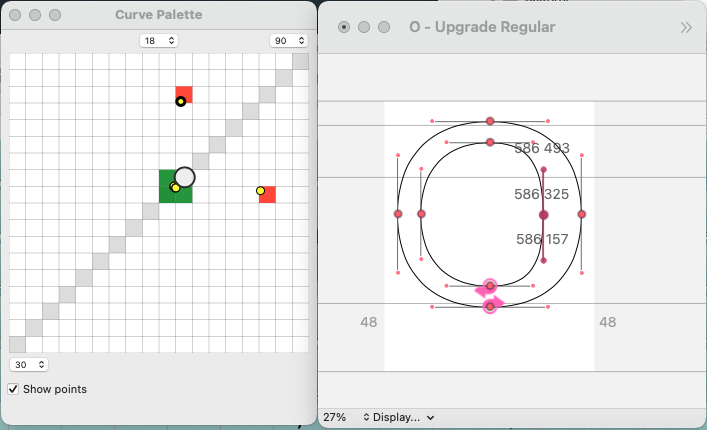

# TYPETR Curve Palette

Curve Palette is an update of the classic tool (25+ year old), that allows the selection of curves as if it was a color.

Think of a Bezier as a combination of 2 on-curve points with 2 off-curves in between. The tension of the curve depends on the ratio of the off-curve running between the neighbour on-curve and the intersection point of the two lines. Call the running position a value between 0% and 100%.

Low percentages give a flat curve (e.g. 30% of the distance from on-curve to intersection)

High percentages give a sharp curve (e.g. 90% of the distance from on-curve to intersection).

Horizontal grid changes define the horizontal percentage.


Vertical grid changes defined the vertical percentage.


Theoretically is it possible to draw Beziers with a very different handle length on both sides. However, when translating them into Quadratics, this give underiable results. 

If the length of the handles is not similar, the selected points appear outside the gray diagonal. 

It is best practice to keep the ratios of the two handles as similar as possible. The gray diagonal shows the grid positions where the handles are identical.

Select one or more points in the EditorWindow, and guess the position in the grid for the best percentage of the handles. You may click several times to find the right curvature (especially with a fine grid). 

If there are other curve points in the grid, they show up as colored cells, grouping them together in the same rounded value. Also the actual value of the points is shown as yellow markers. A thick black outline around such a marker indicates that the point is selected.

Cells can have 3 colours:

* Green: there are points with these handle ratios, but none of them are selected.
* Red: there are points with these handle ratios, and all of them are selected.
* Black: there are points with these handle ratios, some of them are selected and some of them are not.

The checkbox **[x] Show points** shows/hides the actual position of the point ratios.

The circle marker indicates the position on the diagonal where the Bezier is closest to 1/4 circle. 

The bottom-left popup shows the minimum percentage of the grid. Choosing a lower value will give more choice, but it makes the grid selection more rough. In practice Beziers hardly ever need a value below 30%.

The top-right popup shows the maximum percentage of the grid. Choosing a higher value will give more choice, but it also makes the grid selection more rough. In practice 100% (when the off-curves overlap) is hardly ever used. (Unlike quadratics, where overlapping off-curves are sometimes used to simlate corners).

The popup on top of the window gives a choice for the amount of cells in the grid. A fine grid may make the selection of the right cell more difficult. Where a rough grid may force too much roundings on the position of the off-curves.

Teh values for the popups are stored in the current font as default for next time that the CurvePalette is opened.

The CurvePalette works both for Bezier and Quadratic curves, although the seleced min-max popup may select a different value, since the whole grid is then shifted a bit. 

#####Bezier

#####Quadratic

(It is a bug that the position of the circle-marker is on the same position for Bezier and Quadratic. It should shift for Quadratics).

## Selecting

There is a new function, compared with the classic CurvePalette: selection of points. This makes it possible to find points with a ratio far outside the gray diagonal. Hold down the alt-key and drag a marquee over the points to select. Adding the shift-key will preserve or reverse existing point selections. Otherwise a new marquee will first clear the existing selection.

## Known issues

* There is some rounding happening for ratios on the sides of the grid
* The circle marker should change position for Quadratic curves.
* CurvePalette is not aware yet if fonts close/open or should change settings if another font becomes current.
* More functions can be added, such as generating a circle curve from an oncurve-corner Bezier.

Feedback on bugs, manual or feature requests are welcome.

