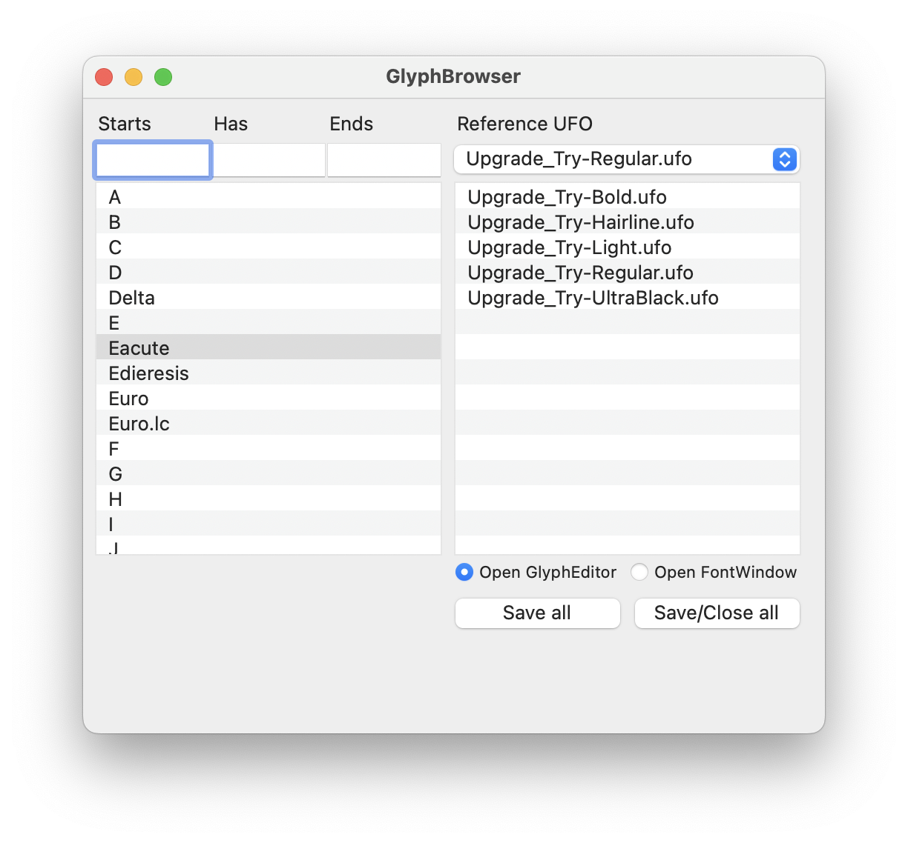
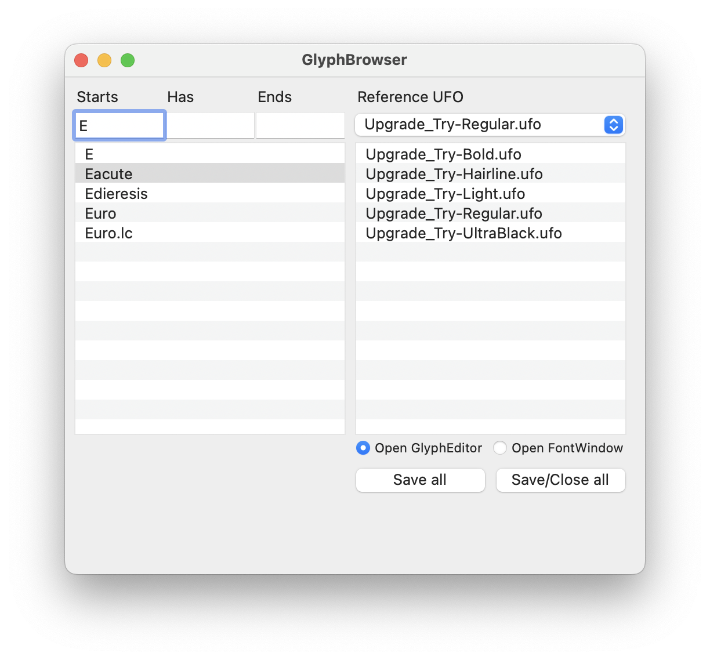
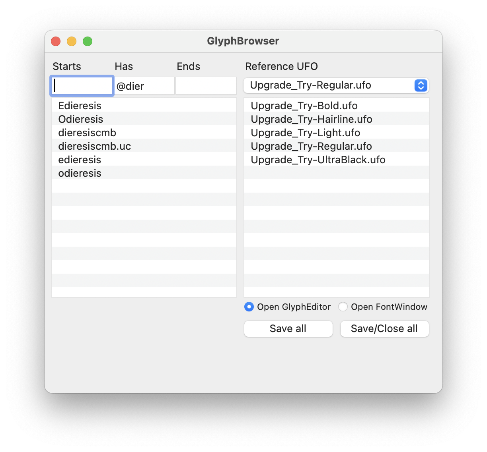

# TYPETR Assistant

The TYPETR Assistant is offers (will offer) similar functions as Prepolator, but faster because fonts only get opened with the interface if there is an EditorWindow needed.

## Management of masters

When started, the Assistant takes the open fonts in RoboFont as list in the *[Reference UFO]* popup. 
The selected “Reference UFO” will be used as source for the glyphset and all UFO’s in the same directory will be  used in the list below the reference popup. 

The tool also decides to filter the UFO names if there is *Italic* in the same, in a similar way as the selected reference UFO.

If there are UFO’s open from different directories, then the UFO names list is defined by the selected *[Reference UFO]*.

Double-click on a UFO name (or multiple names) opens the FontWindow for that glyph.

## Filtering the glyph set

The three checkboxes on top of the selected glyph set offer a fast and flexible way to filter the glyph names. The [Starts] is the filter pattern on the left side to select glyph name. The [End] is the filter pattern on the right side of the glyph name. And the [Has] pattern is compared if it exists somewhere in the name. 

All patterns work together in “and” mode. If a pattern field is empty, it fits every name.
 

Double-click on the glyph name opes the EditorWindow for that glyph in the selected UFO.

### Selection by component

The Assistant now has improved glyph selection. 
The “@” symbol starts the pattern part for the component name. I can be used in each of the **Start-Has-End** boxes. You can combine this with the glyph name selection itself. So instead of 

	Start=A 
	
you can also say

	Start=E@acu 
	
which will select /Eacute

	Start=S Has=.sc 
	
does select all small caps that for names that start with /S

	Start=E@ac Has=.sc 
	
does select all small caps that start with “E” that contain an /acute component

	Has=o End=.lc
	
does select all “.lc” lower case that have an “o” in the name

	Has=@cu 
	
selects all glyphs that contain a component where the name contains “cu”, so this includes /Eacute, /Oacute, /acutecmb, /acutecmb.uc, /eacute, /oacute

## Checking interpolation

This is next to be implemented.

## Master meta-info and design space.

This tool probably can also be useful to keep the *font.info* parameters consistent between masters. And it may be used to generate a draft design space file for the masters in the referenced UFO directory, guessing their position in the design space from patterns in the name.

## Known issues